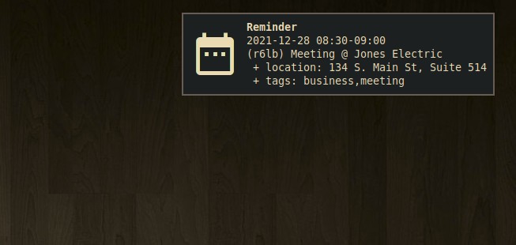

# nrrdalrt

Task and event notifications for `nrrdtask` and `nrrdate`. `nrrdalrt` supports both desktop and email notifications. 

## Contents

- [Getting nrrdalrt](#getting-nrrdalrt)
    - [Downloading](#downloading)
    - [Python dependencies](#python-dependencies)
    - [Installing](#installing)
        - [Setuptools](#setuptools)
        - [Make](#make)
- [Using nrrdalrt](#using-nrrdalrt)
    - [Basic usage](#basic-usage)
    - [Configuration](#configuration)
        - [Default configuration](#default-configuration)
        - [Alternate configuration](#alternate-configuration)
        - [Editing configuration](#editing-configuration)
        - [Main configuration options](#main-configuration-options)
        - [Reminder commands](#reminder-commands)
    - [Reminder data](#reminder-data)
        - [Reminder data fields](#reminder-data-fields)

## Getting `nrrdalrt`
### Downloading
To download `nrrdalrt` simply clone this repository:

    git clone https://github.com/sdoconnell/nrrdalrt.git

### Python dependencies
`nrrdalrt` requires Python 3.8+ and the following Python 3 libraries to be available:

- `notify2`
- `daemonize`
- `dateutil`
- `tzlocal`

You may install these dependencies from your Linux distribution's repos (if available) or via `pip` using the `requirements.txt` file provided in this repository:

    pip install -r requirements.txt

### Installing
You may install the application one of two ways: via `setuptools`, or via `make`. Installing via `make` will also install the manpage for `nrrdalrt(1)` and will copy the `README.md` file into your system documentation directory.

#### Setuptools
Run the `setup.py` script to install system-wide (likely requires `su` or `sudo`):

    sudo python3 setup.py install

Alternatively, you may install the package to your `$HOME` directory.

    python3 setup.py install --user

#### Make
Use `make` to install the application system-wide (likely requires `su` or `sudo`):

    sudo make install

There is also an `uninstall` operation available:

    sudo make uninstall

## Using `nrrdalrt`
### Basic usage
`nrrdalrt` is a command-line daemon that runs as a background process.

    usage: nrrdalrt [-h] [-c <file>] for more help: nrrdalrt <command> -h ...

    Task and event notifications for nrrdtask and nrrdate.

    commands:
      (for more help: nrrdalrt <command> -h)
        config              edit configuration file
        start               start the daemon
        stop                stop the daemon
        version             show version info

    optional arguments:
      -h, --help            show this help message and exit
      -c <file>, --config <file>
                            config file

Unless a specific configuration file is required, simply running `nrrdalrt start` will start the daemon. A running instance of `nrrdalrt` will store its PID in `$TMPDIR/$UID_$HOSTNAME_nrrdalrt.pid`. To stop the daemon, use the command `nrrdalrt stop`.

### Configuration
#### Default configuration
By default, `nrrdalrt` reads its configuration from a config file located at either `$XDG_CONFIG_HOME/nrrdalrt/config` or `$HOME/.config/nrrdalrt/config`. If the default configuration file does not exist, `nrrdalrt` will attempt to create the file with default options specified.

#### Alternate configuration
Instead of the default configuration file, an alternate config file may be selected by using the command-line argument `-c <file>`.

#### Editing configuration
For convenience, the `config` command will open the config file in your `$EDITOR`.

#### Main configuration options
The following options are available under the `[main]` header of the configuration file:

- `notify_icon` : (str) file path for the icon to be used in desktop notifications.
- `refresh_interval` : (int) interval (in minutes) to refresh reminder data from `nrrdtask` and `nrrdate` (default: 5). Use a value greater than 1.
- `mailer_cmd` : (str) the command to use for sending email reminders (default: `mutt -s %s -- %r << EOF %b`).
- `sound_cmd` : (str) the command to play a sound to accompany desktop notifications.

A custom `mailer_cmd` must include the following placeholders:
- `%s` : the email subject
- `%r` : the email recipient
- `%b` : the email body

#### Reminder commands
The `[commands]` section of the configuration file contains the commands to generate reminder data. You may add as many entries as you like. The key names (e.g., `some_cmd = `) are informational and ignored by `nrrdalrt`. You may use any arbitrary key names under the `[commands]` section. The typical `[commands]` section might look like:

    [commands]
    tasks_cmd  = nrrdtask reminders 15m
    events_cmd = nrrdate reminders 15m

This will generate reminder data for all reminders due in the next 15 minutes from both `nrrdate` and `nrrdtask`. This configuration should ensure all reminders are captured if used with the default `refresh_interval` of five minutes.

If you have multiple `nrrdtask` or `nrrdate` configs/data directories and wish to generate notifications for all, you can simply add more commands to the `[commands]` section. However, you **must** use a unique key for each command. For example:

    [commands]
    tasks_personal_cmd = nrrdtask -c ~/.config/nrrdtask/personal.conf reminders 15m
    tasks_business_cmd = nrrdtask -c ~/.config/nrrdtask/business.conf reminders 15m
    events_personal_cmd = nrrdate -c ~/.config/nrrdate/personal.conf reminders 15m
    events_business_cmd = nrrdate -c ~/.config/nrrdate/business.conf reminders 15m

**NOTE:** As a general rule, the interval parameter used for `nrrd* reminders <interval>` should be longer than `refresh_interval`.

### Reminder data
Reminder data is generated from `nrrdate` and `nrrdtask` using the `reminders <interval>` command option. `nrrdalrt` will periodically poll these applications and collect the JSON output they produce (at the interval defined by the `refresh_interval` configuration parameter).

#### Reminder data fields
Reminders generated from `nrrdate` and `nrrdtask` are output in JSON. Each reminder has the following fields:
- `datetime` : the date and time the reminder should be triggered.
- `notification` : the kind of notification to generate either `display` (desktop notification) or `email`.
- `address` : the recipient email address (only provided for `email` notifications).
- `summary` : the notification summary (the task or event `description` field).
- `body` : the notification body. The body for `email` notifications may be more verbose than for `display` notifications, also including data from the task or event's `notes` field. The body for an email notification always ends with `EOF`.

